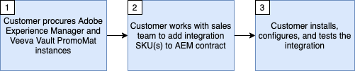

# 開始使用Veeva Vault PromoMats與Adobe Experience Manager整合

此整合可管理您的內容、強制實行許可權和合規性，同時利用同級體驗傳遞中的第一名。

此整合需要下列最低軟體版本：

* Adobe Experience Manager， 6.5.5+
* Veeva Vault PromoMats，20R3.2+

>[!NOTE]
>
>這兩個系統都需要服務使用者和適當的許可權才能進行整合。
>

>[!IMPORTANT]
>
>這項功能無法立即在產品中使用。 實作需要Adobe諮詢維護合約。 請洽詢您的Adobe代表以瞭解更多資訊。
>

## 原理和功能

此整合旨在支援兩個主要使用案例：

1. 內容核准 — 當在AEM中建立新內容或編輯現有內容時，內容必須核准為可在VVPM中使用，以支援生命科學的醫療、法律、法規(MLR)核准程式。
1. 內容管理 — 透過在PromoMats中針對源自AEM的檔案建立數位策略（例如電子郵件、簡報、網站）與其在AEM中建立的元素（例如標誌、攝影、圖形）之間的關係，來提供資產使用率的可見度。

其優點包括：

* 維護資產和內容的單一信任來源，避免跨數位存放庫重複。
* 運用Veeva Vault進行許可權和合規性管理，並運用AEM進行同級最佳和資產最佳以及內容建立/交付。
* 協助在AEM和Veeva Vault之間自動移動內容和中繼資料。
* 減少傳送內容至Veeva以供核准工作流程的人工工作。
* 每個系統都有其優勢，聯結器可協助在系統之間自動移動內容，以加速上市時間。

整合有什麼作用？

* 支援將AEM網站頁面、資產、內容片段和體驗片段傳送至VPM。 AEM頁面、內容片段和體驗片段可以熒幕擷圖PDF或影像的形式傳送。 AEM Assets二進位檔會依原樣傳送。
* 支援從AEM到VPM可設定的特定中繼資料元素的手動和自動同步。
* 支援從VPM到AEM可設定的特定中繼資料元素的手動和自動同步。
* 支援VPM中AEM網站頁面、資產、內容片段和體驗片段之間的關係，以自動化內容關係。
* 支援為多種裝置型別產生轉譯。

>[!NOTE]
>
>如需設定選項的詳細資訊，請參閱整合使用檔案。
>

聯結器沒有做什麼？

* 不會在Veeva中複製AEM流程和功能，反之亦然。
* 不會單獨執行MLR。 它有助於將內容傳送至Veeva的自動化，以便送達MLR發生的地點。
* 不用於在AEM和Veeva之間建立相同的設定。 並非所有內容都需要在兩個平台之間移動。

>[!IMPORTANT]
>
>此整合目前將AEM視為內容同步處理的信任來源。

## 取得整合

若要布建此整合，您必須依照下列步驟操作。

請依照下方的流程圖和流程圖詳細資訊，請求並設定整合。

流程圖詳細資料（對應至上述步驟）：

* **步驟1**  — 假設您已擁有或正在取得Veeva Vault PromoMats和Adobe Experience Manager的授權。
* **步驟2**  — 需要簽署新的銷售訂單(SO)，其中列出與Adobe Consulting的維護合約，才能利用整合。
* **步驟3**  — 安裝、啟動及設定整合套件。

## 支援

以下說明如何聯絡支援團隊並記錄問題。

### 請求整合或Adobe Experience Manager支援

支援票證可透過Adobe客戶服務進行記錄。 您的Adobe Experience Cloud管理員需要登入 [Adobe Admin Console](https://adminconsole.adobe.com/)，按一下「支援」標籤，並建立案例。 若有任何整合問題，請務必包含下列資訊：

* **程式標題**： `AEM - Veeva Vault Integration`
* **程式擁有者**： `Data Engineering`
* **說明**： `Description of the issue`
* **聯絡點**： `The email address(es) for relavant AEM point of contacts for your organization.`
* **AEM執行個體URL**： `Place the Adobe Experience Manager instance url here.`
* **Veeva執行個體URL**： `Place the Veeva Vault PromoMats instance url here.`

### 請求Veeva Vault PromoMats支援

有時候，遇到的問題與Veeva Vault PromoMats例項的運作有關。 如果是這種情況，可能會將您的Veeva Vault PromoMats管理員導向建立支援票證，具有 [Veeva支援](http://support.veeva.com/). 您可以導覽至「 」，檢視Veeva例項的狀態 [Veeva Trust](http://trust.veeva.com/).

