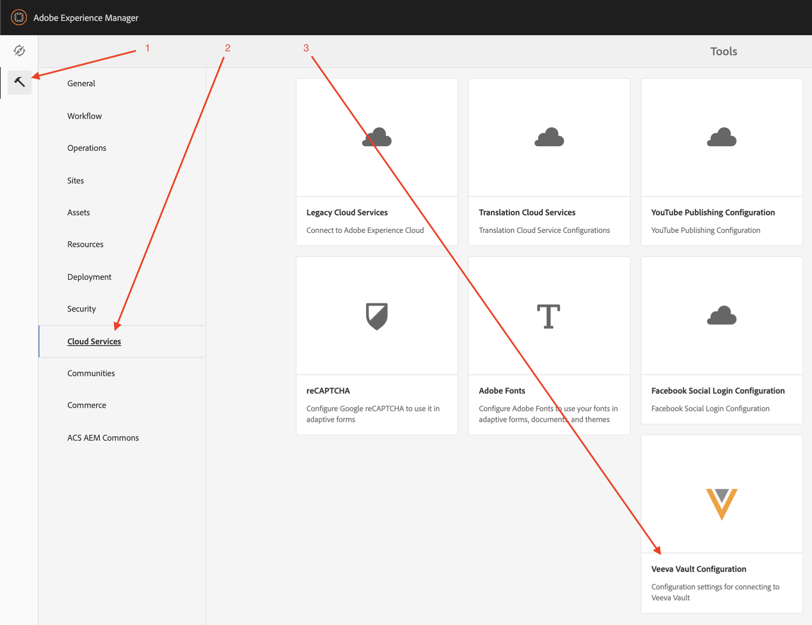
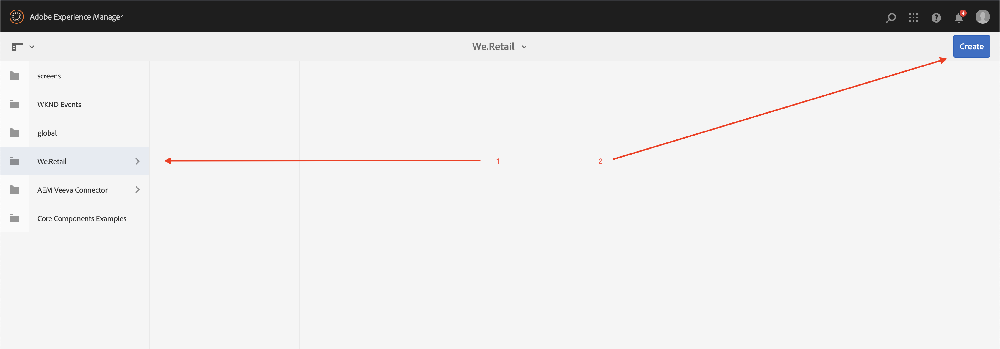
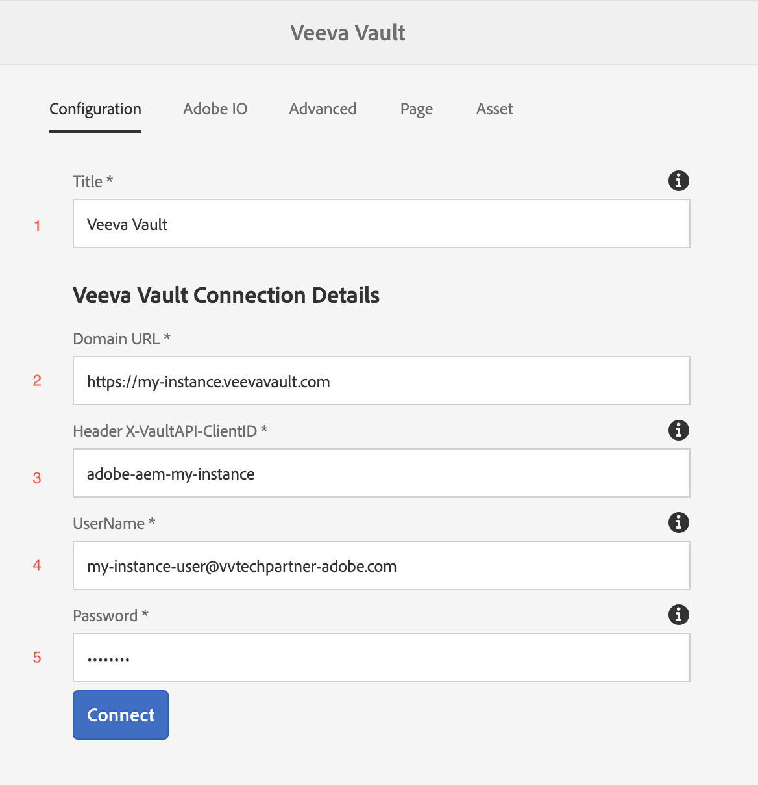
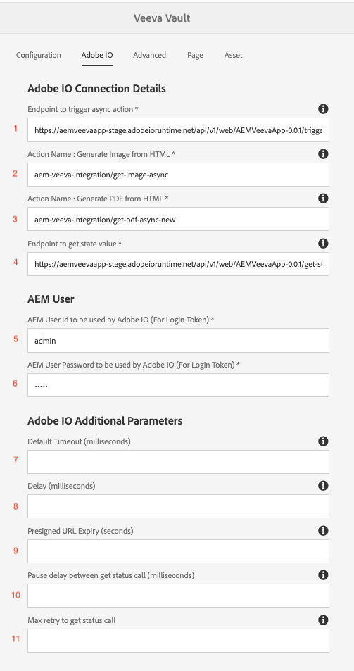
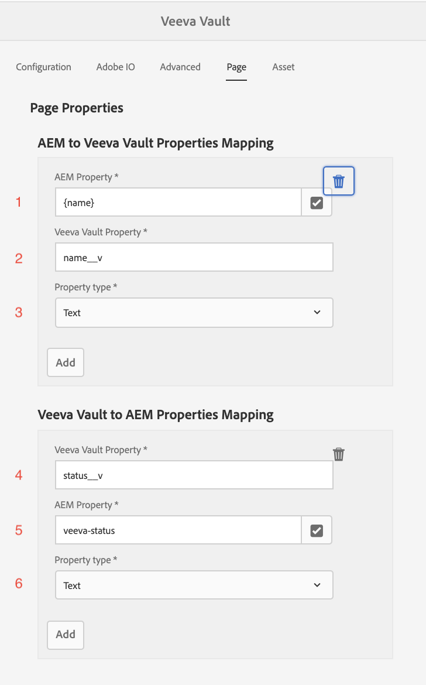
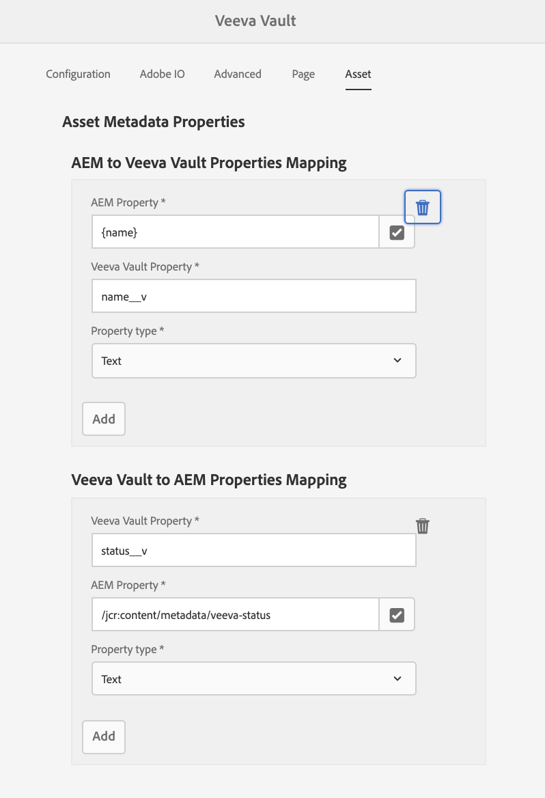
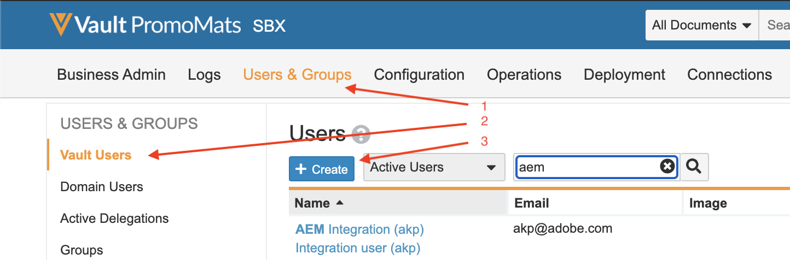
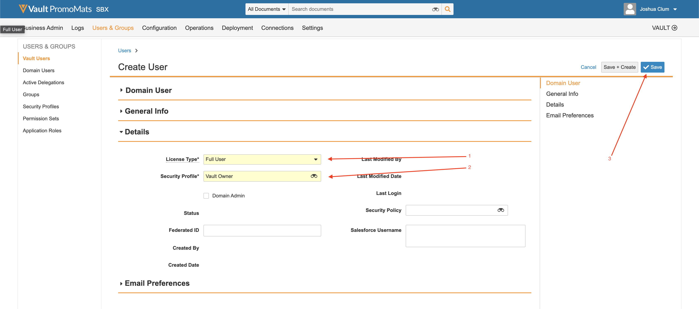

# 整合使用情況

## 逐步解說

以下影片逐步說明如何使用聯結器：

>[!VIDEO](https://video.tv.adobe.com/v/332137/?quality=12&learn=on)

## 設定

本指南將引導您逐步啟動和執行聯結器。

>[!IMPORTANT]
>
>對於每個系統，這些步驟需要由 **管理員** 每個系統。
>
>本檔案中的步驟將指導您建立涉及指派許可權和/或管理員存取權的整合/註冊。  您有責任在執行前確保這些步驟符合貴公司的政策，並仔細執行。
>

### 安裝整合套件

您將獲得整合AEM套件的存取權。 安裝整合有兩個選項：

1. **套件安裝**  — 直截了當，事半功倍。
2. **POM安裝**  — 進階版，但在使用AEM Cloud Manager和升級整合時可能很有用。

#### 套件安裝

若要安裝套件，請透過入門電子郵件中提供的連結下載套件。 [按一下這裡，可以找到安裝AEM套件的詳細指示。](https://experienceleague.adobe.com/docs/experience-manager-64/administering/contentmanagement/package-manager.html?#installing-packages)

#### POM安裝

若要在POM中加入聯結器，請遵循下列步驟。 將您的使用者名稱和密碼替換為入門電子郵件中收到的使用者名稱和密碼。

1. 將下列專案新增至 `.cloudmanager/maven/settings.xml` 您的專案中的檔案或 `~/.m2/settings.xml` 在您的電腦上。 取代 `YOUR_USERNAME` 搭配使用者名稱和 `YOUR_PASSWORD` 使用入門電子郵件中提供的密碼。

   >[!IMPORTANT]
   >
   >如果使用Cloud Manager，安全方法是遵循以下步驟操作 [受密碼保護的Maven存放庫](https://experienceleague.adobe.com/docs/experience-manager-cloud-service/onboarding/getting-access/create-application-project/setting-up-project.html?lang=en#password-protected-maven-repositories).
   >

   ```
   <settings>
       ...
       <servers>
           ...
           <server>
               <id>repo.ea.adobe.net</id>
               <username>YOUR_USERNAME</username>
               <password>YOUR_PASSWORD</password>
               <filePermissions>BucketOwnerFullControl</filePermissions>
               <configuration>
                 <wagonProvider>s3</wagonProvider>
               </configuration>
           </server>
           ...
       </servers>
       ...
   </settings>
   ```

2. 將下列專案新增至專案的 `pom.xml` 檔案：

   ```
   <project>
       ...
       <build>
           ...
           <extensions>
               ...
               <extension>
                   <groupId>com.allogy.maven.wagon</groupId>
                   <artifactId>maven-s3-wagon</artifactId>
                   <version>1.2.0</version>
               </extension>
               ...
           </extensions>
           ...
       </build>
       ...
       <repositories>
           ...
           <repository>
               <id>repo.ea.adobe.net</id>
               <url>s3://repo.ea.adobe.net/release</url>
               <releases>
                   <enabled>true</enabled>
               </releases>
           </repository>
           ...
       </repositories>
       ...
   </project>
   ```

3. 將下列專案新增至專案的 `all/pom.xml` 檔案。 取代 `project.dependencies.dependency.version` 搭配適當版本和 `project.build.plugins.plugin.configuration.embeddeds.embedded.target` 路徑正確。

   ```
   <project>
       ...
       <build>
           ...
           <plugins>
               ...
               <plugin>
                   <groupId>org.apache.jackrabbit</groupId>
                   <artifactId>filevault-package-maven-plugin</artifactId>
                   ...
                   <configuration>
                       ...
                       <embeddeds>
                           ...
                           <embedded>
                               <groupId>com.adobe.acs.aemveeva</groupId>
                               <artifactId>aem-veeva-connector.all</artifactId>
                               <type>zip</type>
                               <target>/apps/APP_NAME-packages/application/install</target>
                           </embedded>
                           ...
                       </embeddeds>
                   </configuration>
               </plugin>
               ...
           </plugins>
           ...
       </build>
       ...
       <dependencies>
           ...
           <dependency>
               <groupId>com.adobe.acs.aemveeva</groupId>
               <artifactId>aem-veeva-connector.all</artifactId>
               <version>1.0.5</version>
               <type>zip</type>
           </dependency>            
           ...
       </dependencies>
       ...
   </project>
   ```

### 雲端設定

若要設定此整合，可在聯結器將運作的資料夾上建立雲端設定。 請依照下列步驟建立雲端設定：

1. 導覽至Veeva雲端設定。

   

2. 在適當的資料夾中建立新的Veeva雲端設定，並依照下節所述填入。

   

#### 組態標籤

在設定索引標籤中填寫下列內容：



1. 必填。 Veeva Vault聯結器設定的標題。 此值可為任意值。 (例如： `Veeva Vault Configuration`)
2. 必填。 Veeva例項的網域URL (例如 `https://my-instance.veevavault.com/`)
3. 必填。 呼叫Veeva Vault API所需的ClientID。 此值可為任意值，主要用於偵錯。 (例如： `adobe-aem-vvtechpartner`)
4. 必填。 Veeva儲存庫使用者名稱。 另請參閱 [Veeva使用者建立](#veeva-user-creation).
5. 必填。 Veeva儲存庫密碼。 另請參閱 [Veeva使用者建立](#veeva-user-creation).

#### AdobeIO標籤

如果專案需要產生頁面的PDF或影像，則需要此索引標籤。 在adobe io標籤中填寫下列內容：



1. 必填。 用於建立PDF影像的AdobeIO端點，該影像提供在入門電子郵件中。 (例如： `https://my-namespace.adobeioruntime.net/api/v1/web/aem-veeva-serverless-0.0.2/trigger-action.json`)
2. 必填。 產生頁面影像的動作名稱。 此值必須 `aem-veeva-integration/get-image-async`.
3. 必填。 用於產生html影像的動作名稱。 此值必須 `aem-veeva-integration/get-pdf-async-new`.
4. 必填。 AdobeIO端點，用於取得入門電子郵件中提供的層代狀態。(例如： `https://my-namespace.adobeioruntime.net/api/v1/web/aem-veeva-serverless-0.0.2/get-state-value`)
5. 必填。 AdobeIO使用的AEM使用者名稱。 另請參閱 [AEM使用者建立](#aem-user-creation).
6. 必填。 AdobeIO使用的AEM密碼。 另請參閱 [AEM使用者建立](#aem-user-creation).
7. 選填。 預設逾時是讓頁面在指定的時間之前回應，過了指定的時間後AIO服務就會停止嘗試取得回應。 預設值為 `30000`.
8. 選填。 延遲是指頁面已以200回應延遲，以讓所有影像在擷取熒幕擷圖之前呈現。 預設值為 `2000`.
9. 選填。 熒幕擷圖/PDF產生的URL將在設定的值（以秒為單位）後過期。
10. 選填。 AdobeIO熒幕擷圖/PDF產生服務非同步。 AEM服務會呼叫AIO狀態端點來取得熒幕擷圖/PDF。 此屬性將決定每個狀態呼叫之間的暫停時間（毫秒）。 預設值為 `10000`.
11. 選填。 對AdobeIO進行狀態呼叫以取得熒幕擷圖/PDF的最大重試計數。 預設值為 `10`.

#### 進階索引標籤

在進階索引標籤中填寫下列內容：


1. 產生PDF/影像時需要。 建立PDF/影像時使用的檔案名稱模式。 `{name}` 可以樣板化。 (例如： `{name}-screenshot`)
2. 選填。 需要案頭以外的頁面熒幕擷圖的裝置型別。 有效的型別包括 `Tab (iPad)`、和 `Mobile (iPhone X)`.
3. 選填。 Veeva中代表上述轉譯的轉譯型別值。 (例如： `web_ready__c`)
4. 產生PDF/影像時需要。 要建立的熒幕擷圖型別。 兩者之一 `PDF` 或 `Image`.
5. 產生PDF/影像時需要。 要產生的PDF型別。 兩者之一 `Print CSS Based PDF` 或 `Pixel Perfect Screenshot PDF`.
6. 產生PDF/影像時需要。 要產生的影像型別。 兩者之一 `PNG` 或 `JPEG`.
7. 必填。 Veeva Vault核准觸發程式完成後要執行的工作流程。
8. 必填。 代表「已核准」的狀態屬性值。 (例如： `Approved for Distribution`)
9. 必填。 Veeva Vault拒絕觸發程式完成後要執行的工作流程。
10. 必填。 代表「已拒絕/未核准」的狀態屬性值。 (例如： `Rejected`)
11. 選填。 Veeva Vault中檔案ID的屬性名稱。 預設值為 `id`.
12. 選填。 Veeva Vault中「狀態」的屬性名稱。 預設值為 `status__v`.
13. 選填。 檔案修改日期的屬性名稱。 預設值為 `version_modified_date__v`.
14. 選填。 檔案資源URL的屬性名稱。 預設值為 `external_id__v`. 如果此欄位已使用，請在Veeva中建立其他欄位，並在此填入欄位名稱。 此欄位將用於Veeva以儲存AEM資源路徑。 自動化中繼資料同步時需要此專案。
15. 選填。 Veeva Vault中主要版本號碼的屬性名稱。 預設值為 `major_version_number__v`.
16. 選填。 Veeva Vault中次要版本號碼的屬性名稱。 預設值為 `minor_version_number__v`.
17. 選填。 Veeva儲存庫關係型別值。 根據此值，所有新增至頁面的資產都會呈現為相關資產。 預設值為 `supporting_document__c`.

#### 頁面索引標籤

如果同步頁面，請在頁面索引標籤中填寫以下內容：



1. 必填。 將屬性從AEM對應至Veeva。
a. AEM屬性名稱。 可從AEM屬性中選取。 (例如： `jcr:title`) `{name}` 可以樣板化。
b.完全在輸入的Veeva屬性名稱在Veeva中已存在。 (例如： `name__v`)\
   c.屬性型別。 兩者之一 `Text` 或 `Multiline Text`.

2. 必填。 將屬性從Veeva對應至AEM。
a.完全在輸入的Veeva屬性名稱在Veeva中已存在。 (例如： `name__v`) b. AEM屬性名稱。 可從AEM屬性中選取。 (例如： `jcr:title`) c.屬性型別。 兩者之一 `Text` 或 `Multiline Text`.


#### 資產標籤

如果同步資產，請在資產索引標籤中填寫以下內容：



1. 必填。 將屬性從AEM對應至Veeva。
a. AEM屬性名稱。 可從AEM屬性中選取。 (例如： `/jcr:content/metadata/jcr:title`) `{name}` 可以樣板化。
b.完全在輸入的Veeva屬性名稱在Veeva中已存在。 (例如： `name__v`) c.屬性型別。 兩者之一 `Text` 或 `Multiline Text`.

2. 必填。 將屬性從Veeva對應至AEM。
a.完全在輸入的Veeva屬性名稱在Veeva中已存在。 (例如： `name__v`) b. AEM屬性名稱。 可從AEM屬性中選取。 (例如： `/jcr:content/metadata/jcr:title`) c.屬性型別。 兩者之一 `Text` 或 `Multiline Text`.

### 其他設定

#### AEM使用者建立

在PDF/影像產生期間，需要建立AEM使用者，才能從AEM取得頁面。 透過下列連結，建立並授與使用者唯讀許可權：

如果使用AEM 6.5.5+：

* [在AEM中建立使用者](https://experienceleague.adobe.com/docs/experience-manager-65/forms/administrator-help/setup-organize-users/adding-configuring-users.html?#create-a-user)
* [在AEM中新增許可權給使用者](https://experienceleague.adobe.com/docs/experience-manager-65/administering/security/security.html?#permissions-in-aem)

如果使用AEMCloud Service：

* [使用AEMCloud Service管理使用者](https://experienceleague.adobe.com/docs/experience-manager-learn/cloud-service/accessing/aem-users-groups-and-permissions.html?#accessing)

AEM服務使用者需要下列許可權，才能存取將轉換成PDF/影像並推送至Veeva的內容：

* 讀取

>[!IMPORTANT]
>
> 這些動作必須以每個系統的管理員身分執行。
> 在建立使用者和設定許可權時，您必須遵守組織安全性標準。
>

#### Veeva使用者建立

若要使用此整合，需在Veeva Vault中建立使用者。 若要建立使用者，請執行下列步驟：

1. 瀏覽至「管理員 — >使用者和群組 — >儲存庫使用者 — >建立」

   

2. 填寫所需的輸入。 最簡單的設定是設定 `License Type` 至 `Full User` 和 `Security Profile` 至 `Vault Owner`. 完成時儲存。

   

使用的特定Veeva檔案型別需要以下許可權：

* 建立/讀取檔案
* 建立/讀取版本
* 建立/更新中繼資料
* 建立/更新轉譯

>[!IMPORTANT]
>
> 這些動作必須以每個系統的管理員身分執行。
> 在建立使用者和設定許可權時，您必須遵守組織安全性標準。
>
